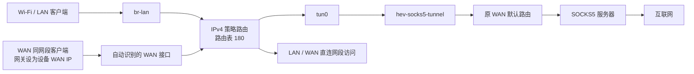
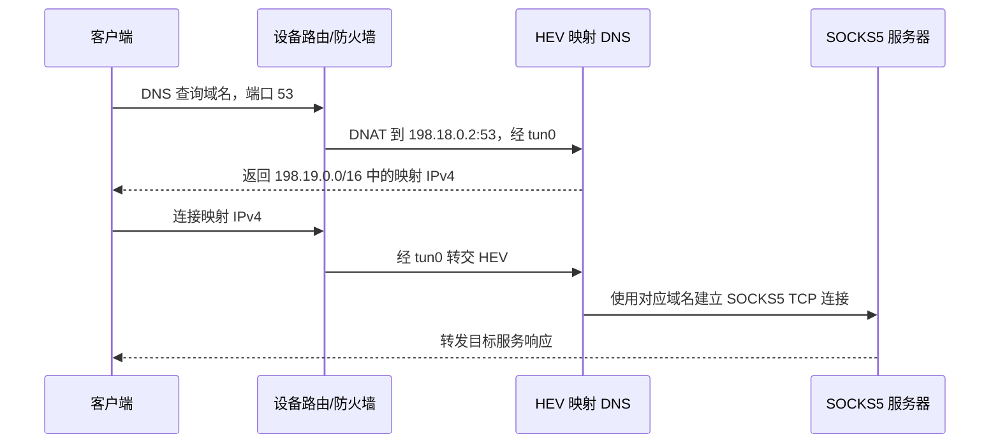

# Oray HEV 代理网关

本目录包含适用于兼容 Oray/OpenWrt 设备的 SOCKS5 代理网关程序、配置和管理脚本。它可以让连接设备 Wi-Fi/LAN 的客户端，以及将设备设为网关的 WAN 同网段客户端，通过 `tun0` 使用 SOCKS5 代理上网。

`hev-socks5-tunnel` 负责把 TUN 中的 TCP/UDP 流量转换为 SOCKS5 会话；`hev-manager.sh` 负责启动程序、配置路由、防火墙和 DNS，并在停止时恢复原网络配置。仅运行 HEV 二进制不会自动完成客户端流量接管。

## 1. 文件介绍

| 文件 | 用途 |
| --- | --- |
| `hev-manager.sh` | 管理脚本，提供 `check / start / stop / restart / status` |
| `hev-socks5-tunnel` | 设备端二进制；名称和部署路径必须与脚本一致 |
| `hev.yml` | SOCKS5 地址、端口、用户名、密码及隧道配置 |
| `README.md` | 部署、使用、架构及排障说明 |

部署所需的是前三个文件。隐藏的 `.ssh`、`.ash_history` 和本地 `.git` 目录不参与代理功能，不需要复制到新设备。

## 2. 适用条件

脚本针对使用 BusyBox、UCI、dnsmasq 和 iptables 的 OpenWrt 衍生系统编写，以 root 身份运行。

- 二进制必须与目标设备的 CPU 架构兼容。本目录中的程序已在原 OrayBox X1 的 MIPS 系统上运行过，其他型号仍需确认兼容性。
- 必须有 `/dev/net/tun`，并已开启 IPv4 转发。
- 需要 `ip`、`iptables`、`ip6tables`、`nslookup`、`sysctl`、`awk`、`readlink`、`flock`、`nohup`、`uci` 及 `/etc/init.d/dnsmasq`。
- Wi-Fi/LAN 桥接口默认固定为 `br-lan`。如果新设备使用其他名称，修改脚本开头的 `LAN`。
- 主路由表中必须有一个可识别的 IPv4 默认路由，以及 WAN、LAN 的直连网段。
- dnsmasq 的第一个实例不能设置 `noresolv=1`。
- `tun0`、路由表 `180`、规则优先级 `18010 / 18020 / 18021` 及脚本定义的 `HEV_*` 防火墙链应由本脚本独占。

脚本按一个 WAN 接口及一个主要直连 IPv4 网段识别网络，未实现多 WAN、多个 WAN 地址或重叠网段的完整处理。

## 3. 部署到设备

在本机进入此目录，将三个运行文件复制到目标设备。下面的 `oray` 是 SSH 别名，部署到另一台设备时替换为它的别名或 `root@设备IP`。

```sh
cd ~/Desktop/oray-hev
scp hev-manager.sh hev-socks5-tunnel hev.yml oray:/root/
ssh oray
```

以下命令在设备上执行：

```sh
chmod 700 /root/hev-manager.sh /root/hev-socks5-tunnel
chmod 600 /root/hev.yml
/root/hev-manager.sh check
```

`check` 输出识别到的 WAN 接口、地址、网段和 LAN 信息。检查通过只代表基础条件满足，并不代表代理密码正确、二进制兼容或代理实际可用。

### 配置代理

编辑设备上的 `/root/hev.yml`。以下仅是格式示例，请替换占位内容：

```yaml
tunnel:
  name: tun0
  mtu: 8500
  multi-queue: false
  ipv4: 198.18.0.1
  ipv6: "fc00::1"

socks5:
  address: "proxy.example.com"
  port: 1080
  udp: "udp"
  username: "YOUR_USERNAME"
  password: "YOUR_PASSWORD"
```

端口使用整数，用户名、密码建议使用引号包围。脚本对代理地址使用简化的 YAML 提取逻辑，`socks5.address` 应单独占一行，值中不要附加行内注释；地址使用 IPv4 或可解析为 IPv4 的域名。

原始 `hev.yml` 不会被脚本覆盖。启动时脚本生成私有运行配置，强制使用 `tun0`，将代理域名替换为当次解析的 IPv4 地址，移除 `pid-file`，并用脚本定义的映射 DNS 配置替换原有 `mapdns` 部分。

## 4. 日常使用

```sh
/root/hev-manager.sh start
/root/hev-manager.sh status
/root/hev-manager.sh stop
/root/hev-manager.sh restart
/root/hev-manager.sh check
```

| 命令 | 行为 |
| --- | --- |
| `start` | 检查环境，启动 HEV，接管客户端流量并切换 DNS |
| `status` | 查看进程、接口、识别到的网段、路由规则及部分防火墙规则 |
| `stop` | 清理脚本添加的网络规则，恢复 DNS 和保存的内核参数，停止 HEV |
| `restart` | 先停止，再重新识别网络、解析代理地址并启动 |
| `check` | 检查命令、设备、接口及基础配置；不启动代理或修改网络配置 |

不带参数时执行 `status`。重复 `start` 不会叠加规则；已有管理状态时应使用 `restart`。

HEV 使用 `nohup` 在后台运行，标准输入连接 `/dev/null`，日志输出到 `/tmp/hev-manager.log`。启动完成后可以断开 SSH，不会因终端关闭而退出。

```sh
tail -f /tmp/hev-manager.log
```

修改代理地址、端口或密码后执行 `restart`。更换网络、WAN 地址变化或重载防火墙后，也需要执行 `restart`。目前没有开机自启；设备重启后需手动执行 `start`。

### Wi-Fi/LAN 客户端

客户端连接设备的 Wi-Fi，使用 DHCP 获取地址。网关及 DNS 应指向设备的 LAN 地址；例如原设备的 LAN 地址是 `192.168.11.1`，新设备以实际配置为准。使用静态地址的客户端需自行填写网关和 DNS。

### WAN 同网段客户端

将其他机器的 IPv4 网关和 DNS 设置为设备当前的 WAN IPv4 地址。

例如，设备当前 WAN 为 `192.168.1.3` 时，客户端填写此地址。搬到其他环境后，不必把原网段写进脚本：每次启动都会从主路由表和接口中自动识别 WAN 地址与网段。

同网段客户端应禁用 IPv6，或另行确保其 IPv6 路由经过受控网关。只修改 IPv4 网关不能阻止客户端通过其他路由器进行 IPv6 直连。

## 5. 原理与架构

### 5.1 数据流



策略路由依据入接口匹配客户端流量。HEV 自己发起的代理连接属于设备本地产生的流量，不匹配客户端入接口规则，因此仍使用原 WAN 默认路由，避免再次进入 `tun0` 形成循环。

设备自身普通流量没有全部接管。例外是受控的 DNS 请求，以及访问映射地址池的流量，它们也会被送入 TUN。

### 5.2 策略路由

| 优先级 | 匹配条件 | 动作 |
| --- | --- | --- |
| `18010` | 本机 DNS 请求标记 `18518`，即 `0x4856` | 查询路由表 `180` |
| `18020` | 从 `br-lan` 进入 | 查询路由表 `180` |
| `18021` | 从识别到的 WAN 接口进入，源地址属于识别到的 WAN 网段 | 查询路由表 `180` |

路由表 `180` 包含 LAN、WAN 直连网段路由和经 `tun0` 的默认路由，同时保留低优先级的 `unreachable default`。TUN 消失时，客户端流量不会继续回退到主路由表的普通外网默认路由。

防火墙允许客户端 TCP/UDP 到 TUN，以及已建立连接的返回流量；LAN 内部和 WAN 同网段访问有相应放行规则。LAN 到 WAN 网段的普通转发目前会被阻断，不能把“保留直连网段路由”理解为所有跨接口内网访问都放行。

脚本关闭 WAN 侧 ICMP 重定向，避免设备建议同网段客户端绕过代理网关、直接使用上游路由器；同时调整反向路径过滤以适应策略路由。

### 5.3 映射 DNS



映射 DNS 不需要把普通 UDP DNS 查询发送到公网 DNS 服务器。它维护域名与合成 IPv4 地址的对应关系，在客户端建立 TCP 连接时，由 SOCKS5 服务器处理目标域名。

- 映射 DNS 地址为 `198.18.0.2:53`。
- 映射地址池为 `198.19.0.0/16`，缓存容量为 `4096`。
- 客户端普通端口 `53` 的 TCP/UDP DNS 请求会被重定向，包括发给设备自身或上游路由器的请求。
- dnsmasq 临时使用 `/tmp/hev-manager-resolv.conf`，让设备本地 DNS 查询也使用映射 DNS。该文件只有 DNS 地址，以 `644` 权限供降权运行的 dnsmasq 读取；含凭据的运行配置保留在私有目录内。
- 主路由表额外加入映射 DNS 地址和地址池到 `tun0` 的路由。
- DNS 切换只使用运行时 `uci set`，不执行 `uci commit`。不要在代理运行期间提交这些临时设置到持久配置。

映射 DNS 不等同于完整的常规 DNS 解析服务。内网专用 DNS、特殊记录类型或需要真实目标 IP 的应用，应另行验证兼容性。加密 DNS 使用其他端口，不属于上述端口 `53` 重定向规则。

### 5.4 IPv6 和 UDP

当前脚本提供 IPv4 代理路由。虽然配置中可包含隧道 IPv6 地址，脚本并未建立客户端 IPv6 全量代理路由。

脚本阻断 LAN 的外部 IPv6 转发，以及从 WAN 进入后再从 WAN 转出的 IPv6 流量。客户端通过其他 IPv6 网关发出的流量根本不会经过此设备，无法由本脚本阻断。

UDP 转发仍依赖 SOCKS5 服务器支持对应的中继方式。映射 DNS 修复了普通 DNS 对上游 UDP 的依赖，并不意味着所有 UDP 应用都能正常运行。普通 ICMP `ping` 也不能作为代理是否健康的可靠判断方法。

## 6. 运行状态和恢复行为

| 路径 | 内容 |
| --- | --- |
| `/tmp/hev-manager/config.yml` | 本次运行使用的配置，包含代理凭据 |
| `/tmp/hev-manager/pid` | HEV 进程号 |
| `/tmp/hev-manager/network` | 启动时识别到的 WAN/LAN 信息 |
| `/tmp/hev-manager/sysctl-save` | 启动前的相关内核参数 |
| `/tmp/hev-manager/dns-resolvfile` | dnsmasq 原来的解析文件路径 |
| `/tmp/hev-manager/active` | 规则安装完成的标记，不代表代理健康 |
| `/tmp/hev-manager/mapped-routes` | 映射地址路由的管理标记 |
| `/tmp/hev-manager-resolv.conf` | 供 dnsmasq 读取的临时上游配置 |
| `/tmp/hev-manager.log` | HEV 日志，停止后保留 |
| `/tmp/hev-manager.lock` | 防止多个管理操作并发执行的锁文件 |

这些运行文件位于 `/tmp`，重启设备后不会保留。不要在运行期间手动删除状态目录，否则 `stop` 可能无法找到恢复原配置所需的信息。

### 正常停止

`stop` 删除脚本的防火墙链及跳转、策略路由和映射地址路由，恢复保存的内核参数，恢复 dnsmasq 原解析文件并重启 DNS 服务，然后停止 HEV。原始 `hev.yml` 保留。

DNS 恢复以当前 dnsmasq 仍使用本脚本的临时解析文件为条件，避免覆盖用户在运行期间另行修改的解析文件设置。这是对脚本所管理配置的恢复，不是整台设备配置的完整快照回滚。

客户端可能缓存旧映射 IP，停止或重启代理后建议断开 Wi-Fi 再连接；必要时重新打开应用或清理客户端 DNS 缓存。

### 异常与健康检测

- 启动过程失败会触发清理回滚，客户端可能恢复普通直连。
- 启动成功后，代理不可达时不自动切换到直连；HEV 通常继续运行，新会话继续尝试连接代理。
- HEV 意外退出后，已安装的阻断规则和不可达默认路由保留，客户端不能自动经 WAN 上网。
- 当前没有定时连通性探测、自动重启、备用代理切换或主动告警。
- `status` 中的进程存活和 `active` 标记不等于实际代理可用。
- 代理域名在启动时解析并固定为 IPv4，域名对应地址变化后需执行 `restart`。
- 防火墙重载或其他程序修改规则可能破坏上述保护；当前没有自动修复规则的后台监控。

## 7. 验证与排障

### 基础检查

```sh
/root/hev-manager.sh check
/root/hev-manager.sh status
ip -4 rule show
ip route show table 180
ip -s link show tun0
```

`status` 提示已有状态但进程未运行时，使用 `restart` 重建，不要仅删除 `/tmp/hev-manager`。

### DNS 检查

```sh
nslookup example.com 198.18.0.2
nslookup example.com 127.0.0.1
```

启动后返回 `198.19.*` 的地址是映射 DNS 的正常行为。有些 `nslookup` 会同时查询 IPv4 和 IPv6；在成功返回 IPv4 后仍显示 IPv6 `No answer`，或返回非零退出码，不能据此直接判定 IPv4 解析失败。

### 网页与客户端流量检查

设备上有 curl 时可以检查：

```sh
curl -sS -m 15 -o /dev/null -w 'HTTP=%{http_code}\n' http://example.com
curl -sS -m 15 -o /dev/null -w 'HTTPS=%{http_code}\n' https://www.baidu.com
iptables -nvL HEV_LAN
iptables -t nat -nvL HEV_CLIENT_DNS
iptables -nvL HEV_DNS_GUARD
```

设备端测试不能替代客户端测试。手机先断开重连 Wi-Fi，再打开网页，观察 `br-lan → tun0` 和 `tun0 → br-lan` 的计数是否增加。

| 现象 | 检查方向 |
| --- | --- |
| 手机连上 Wi-Fi 但打不开网页 | DHCP 地址、网关、DNS，HEV 状态和 DNS 解析 |
| DNS 解析超时 | 映射 DNS 路由、dnsmasq 解析文件及其读权限、DNS 阻断计数 |
| 域名能解析但连接失败 | SOCKS5 地址、端口、认证和服务端连通性 |
| WAN 同网段机器没有走代理 | 客户端网关、源网段、识别到的 WAN 接口和 `18021` 规则 |
| 某些应用失败但网页正常 | UDP 支持、映射 DNS 兼容性及客户端 IPv6 路径 |
| 防火墙重载后异常 | 执行 `restart` 重新安装脚本规则 |
| `tun0`、表或链已存在 | 排查其他管理程序，避免重复启动或混用不同配置脚本 |
| 停止后仍打不开网页 | 重新连接网络或刷新客户端缓存，检查原上游网络是否正常 |

`/tmp/hev-manager.log` 可用于排查连接失败。日志等级、详细错误内容由 HEV 配置和版本决定；不要把 `status` 正常理解为认证或网络测试已通过。

## 8. 上游项目

- [hev-socks5-tunnel](https://github.com/heiher/hev-socks5-tunnel)：TUN 转 SOCKS5 程序、配置格式和原理参考。
- [官方配置示例](https://github.com/heiher/hev-socks5-tunnel#config)：隧道、代理、映射 DNS 及其他运行参数。

本 README 说明的是本目录中 `hev-manager.sh` 的行为，不能替代不同版本 HEV 或其他设备固件的兼容性验证。
