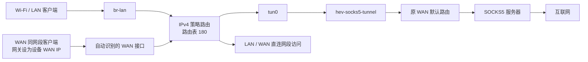
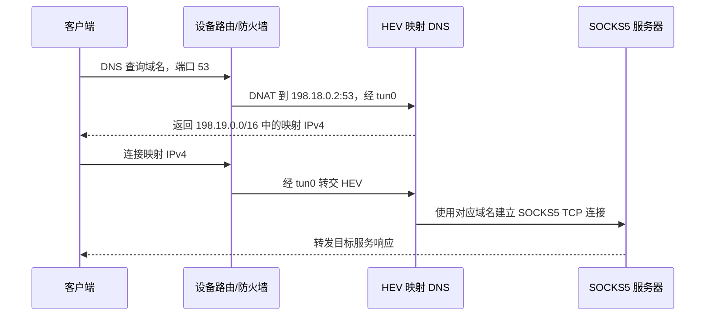

# Oray HEV 代理网关

本目录包含适用于 OpenWrt fw4/nftables 的 SOCKS5 代理网关程序、配置和管理脚本。已在 OrayBox X1 的 OpenWrt 25.12.2 上验证。原厂 iptables 固件使用保留的 `hev-manager-iptables.sh`，不要混用两版。它可以让连接设备 Wi-Fi/LAN 的客户端，以及将设备设为网关的 WAN 同网段客户端，通过 `tun0` 使用 SOCKS5 代理上网。

`hev-socks5-tunnel` 负责把 TUN 中的 TCP/UDP 流量转换为 SOCKS5 会话；`hev-manager.sh` 负责启动程序、配置路由、防火墙和 DNS，并在停止时恢复原网络配置。仅运行 HEV 二进制不会自动完成客户端流量接管。

## 1. 文件介绍

| 文件 | 用途 |
| --- | --- |
| `hev-manager.sh` | fw4/nftables 管理脚本，提供 `check / start / stop / restart / status` |
| `hev-manager-iptables.sh` | 刷机前的原厂 iptables 版，供旧系统使用 |
| `hev-manager-with-leaf.sh` | 同时管理 Leaf 与 HEV，启动前解析上游域名，避免映射 DNS 循环 |
| `leaf-manager.sh` | Leaf 的独立启动、停止、重启和日志管理 |
| `leaf-with-runtime.init` | Leaf procd 服务，支持临时配置路径，安装为 `/etc/init.d/leaf` |
| `leaf-oray-vmess-ws-upx` | 适配 Oray X1 的 Leaf VMess TCP/WS UPX 二进制，约 1.403 MiB |
| `leaf.example.json` | 不含真实节点信息的 Leaf 配置模板，复制成私有 `leaf.json` 后填写 |
| `LEAF-BINARY.md` | Leaf 二进制的构建来源、架构和校验说明 |
| `HEV-WITH-LEAF.md` | Leaf + HEV 统一模式的部署和使用说明 |
| `hev-socks5-tunnel` | 设备端二进制；名称和部署路径必须与脚本一致 |
| `hev.yml` | SOCKS5 及隧道配置模板，认证字段须另行填写 |
| `README.md` | 部署、使用、架构及排障说明 |

独立 HEV 模式需要 `hev-manager.sh`、`hev-socks5-tunnel` 和 `hev.yml` 三个运行文件。Leaf + HEV 模式还需要下面列出的 Leaf 文件及统一管理脚本。隐藏的 `.ssh`、`.ash_history` 和本地 `.git` 目录不参与代理功能，不需要复制到新设备。

使用 VMess + WebSocket 时，本仓库已附 Leaf WS UPX 二进制及配置样例；填写私有节点配置后，按 [Leaf 与 HEV 统一管理](HEV-WITH-LEAF.md) 部署。统一模式无需修改正式 `hev.yml` 的代理地址、端口和认证字段；脚本自动生成指向本地 Leaf 的临时配置。

### 目录层级与安装路径

**设备上的正式配置固定放在 `/root/leaf.json` 和 `/root/hev.yml`。** 脚本及两个二进制也放在 `/root/`；只有 Leaf 的 procd 服务需要安装到 `/etc/init.d/leaf`，并把仓库文件名 `leaf-with-runtime.init` 改为 `leaf`。

本机仓库目录：

```text
~/Desktop/oray-hev/
├── README.md
├── HEV-WITH-LEAF.md
├── FW4-VERIFICATION.md
├── LEAF-BINARY.md
├── LEAF-LICENSE
├── hev-manager.sh
├── hev-manager-with-leaf.sh
├── hev-manager-iptables.sh       # 原厂旧固件专用，fw4 模式不使用
├── leaf-manager.sh
├── leaf-with-runtime.init       # 上传后改名为 /etc/init.d/leaf
├── hev-socks5-tunnel
├── leaf-oray-vmess-ws-upx
├── leaf-oray-vmess-ws-upx.sha256
├── hev.yml                      # Git 中的占位模板
├── leaf.example.json            # Git 中的占位模板
├── hev.private.yml              # 本地真实 HEV 配置，Git 忽略
└── leaf.json                    # 从样例复制并填写的真实 Leaf 配置，Git 忽略
```

设备上的 Leaf + HEV 安装结果：

```text
/
├── root/
│   ├── hev-manager-with-leaf.sh  # 统一模式的操作入口
│   ├── hev-manager.sh            # 统一脚本调用的 HEV 管理脚本
│   ├── leaf-manager.sh           # 统一脚本调用的 Leaf 管理脚本
│   ├── hev-socks5-tunnel         # HEV 可执行文件
│   ├── leaf-oray-vmess-ws-upx    # Leaf 可执行文件
│   ├── hev.yml                  # 正式 HEV 配置
│   ├── leaf.json                # 正式 Leaf 配置
│   └── HEV-WITH-LEAF.md          # 可选：设备端使用文档
├── etc/init.d/
│   └── leaf                     # 来自 leaf-with-runtime.init，由 procd 管理 Leaf
└── tmp/
    ├── hev-leaf-manager/
    │   ├── leaf.json            # 自动生成：上游域名的真实 IP 写入 dns.hosts
    │   └── hev.yml              # 自动生成：127.0.0.1:1080，移除 SOCKS5 认证
    ├── hev-manager/
    │   └── config.yml           # HEV 最终运行配置，含自动生成的 mapdns
    └── hev-manager.log          # HEV 日志；Leaf 日志由 logd 管理
```

`/tmp` 中的文件由脚本自动生成，停止时清理，设备重启后消失。日常修改只编辑 `/root/leaf.json` 和 `/root/hev.yml`，然后执行统一脚本的 `restart`，不要编辑临时配置。

| 仓库或本机文件 | 设备目标路径 | 说明 |
| --- | --- | --- |
| `leaf.example.json` → 本机 `leaf.json` | `/root/leaf.json` | 填写真实 VMess address、port、uuid、WS Host/path |
| `hev.yml` → 本机 `hev.private.yml` | `/root/hev.yml` | 上传私有配置时需改名；联合模式自动覆盖运行时 SOCKS5 后端 |
| `hev-manager-with-leaf.sh` | `/root/hev-manager-with-leaf.sh` | 联合模式使用此入口 |
| `hev-manager.sh` | `/root/hev-manager.sh` | fw4/nftables 管理 |
| `leaf-manager.sh` | `/root/leaf-manager.sh` | Leaf 进程管理 |
| `hev-socks5-tunnel` | `/root/hev-socks5-tunnel` | 名称保持不变 |
| `leaf-oray-vmess-ws-upx` | `/root/leaf-oray-vmess-ws-upx` | 名称保持不变 |
| `leaf-with-runtime.init` | `/etc/init.d/leaf` | 上传时改名，不放在 `/root/` 代替服务文件 |

`leaf.example.json` 是模板名，Leaf 服务实际读取的是 `/root/leaf.json`。仓库目录名可以变化，但设备上的上述路径与脚本定义必须一致。

## 2. 适用条件

当前主脚本针对使用 BusyBox、UCI、dnsmasq 和 fw4/nftables 的 OpenWrt 系统编写，以 root 身份运行。

- 二进制必须与目标设备的 CPU 架构兼容。本目录中的程序已在原 OrayBox X1 的 MIPS 系统上运行过，其他型号仍需确认兼容性。
- 必须有 `/dev/net/tun`，并已开启 IPv4 转发。
- 需要完整版本的 `ip`、`nft`、`fw4`、`nslookup`、`sysctl`、`awk`、`readlink`、`flock`、`nohup`、`uci` 及 `/etc/init.d/dnsmasq`。
- Wi-Fi/LAN 桥接口默认固定为 `br-lan`。如果新设备使用其他名称，修改脚本开头的 `LAN`。
- 主路由表中必须有一个可识别的 IPv4 默认路由，以及 WAN、LAN 的直连网段。
- dnsmasq 的第一个实例不能设置 `noresolv=1`。
- `tun0`、路由表 `180`、规则优先级 `18010 / 18020 / 18021` 、nftables 表 `inet hev_manager` 和 UCI 段 `firewall.hev_manager_forward / firewall.hev_manager_rules` 应由本脚本独占。

脚本按一个 WAN 接口及一个主要直连 IPv4 网段识别网络，未实现多 WAN、多个 WAN 地址或重叠网段的完整处理。

## 3. 部署到设备

下面的 `oray` 是 SSH 别名，部署到另一台设备时替换为它的别名或 `root@设备IP`。配置上传命令用于新设备首次部署；已有真实配置的设备只同步脚本和二进制，保留 `/root/leaf.json` 与 `/root/hev.yml`。

### 原厂 X1 刷入官方 OpenWrt

已实机完成 X1-4111 和 X1-3111 的原厂固件迁移，使用同一份官方 **OpenWrt 25.12.2 / ramips/mt76x8 / oraybox_x1** 镜像。以下步骤记录原厂系统通过 SSH 刷机的流程；已经运行官方 OpenWrt 的设备可直接跳到代理部署部分。

#### 1. 先核实实际硬件

在本机执行只读检查：

```sh
ssh oray 'ubus call system board; cat /proc/cpuinfo; cat /proc/mtd; dmesg | head -n 115'
```

此次 X1-3111 实测为 `HC-WT6271-128`、MT7628AN、128 MiB RAM、16 MiB GD25Q128 NOR。原厂版本是 5.5.1 / Linux 4.4.157，bootloader 为 U-Boot 1.1.3。官方 [X1 支持记录](https://github.com/openwrt/openwrt/commit/6b66666da46dd50d4bd2cb1b94fd35ec7f10e54c) 和 [25.12.2 设备树](https://github.com/openwrt/openwrt/blob/v25.12.2/target/linux/ramips/dts/mt7628an_oraybox_x1.dts) 与该设备的固件起点、身份分区位置及 GPIO 相符：LED 为 37/1/44，复位为 38。

不能只凭“X1”名称刷写；另一台设备应重新核实硬件、分区和 bootloader。不同设备的完整 Flash、factory 无线校准数据、MAC、SSH host key 和恢复包不能互相复制。

#### 2. 备份该设备的 Flash 和配置

以下分区编号仅适用于本次核验的原厂布局：

| 原厂分区 | 设备文件 | 大小 | 用途 |
| --- | --- | ---: | --- |
| u-boot | `/dev/mtd0ro` | `0x30000` | bootloader |
| kpanic | `/dev/mtd1ro` | `0x10000` | 崩溃记录 |
| factory | `/dev/mtd2ro` | `0x10000` | 无线校准数据 |
| firmware | `/dev/mtd3ro` | `0xf90000` | 原厂内核、根文件系统及可写层 |
| bdinfo | `/dev/mtd7ro` | `0x10000` | 设备身份数据 |
| reserve | `/dev/mtd8ro` | `0x10000` | 保留分区 |

在本机将备份放到独立的私有目录；根据设备修改目录名前缀，随机后缀可避免覆盖已有备份。任一备份命令失败时停止，排查后重新备份：

```sh
umask 077
backup_dir=$(mktemp -d "$HOME/Desktop/oray-x1-3111-backup-XXXXXXXX")
ssh oray 'cat /dev/mtd0ro' > "$backup_dir/uboot.bin"
ssh oray 'cat /dev/mtd1ro' > "$backup_dir/kpanic.bin"
ssh oray 'cat /dev/mtd2ro' > "$backup_dir/factory.bin"
ssh oray 'cat /dev/mtd3ro' > "$backup_dir/firmware.bin"
ssh oray 'cat /dev/mtd7ro' > "$backup_dir/bdinfo.bin"
ssh oray 'cat /dev/mtd8ro' > "$backup_dir/reserve.bin"
ssh oray 'tar -czf - /etc /root 2>/dev/null' > "$backup_dir/config-root.tar.gz"
cat "$backup_dir/uboot.bin" "$backup_dir/kpanic.bin" "$backup_dir/factory.bin" \
    "$backup_dir/firmware.bin" "$backup_dir/bdinfo.bin" "$backup_dir/reserve.bin" \
    > "$backup_dir/fullflash.bin"
wc -c "$backup_dir/fullflash.bin"
```

完整 Flash 必须是 **16,777,216 字节**。逐分区核对本机文件与设备读出的 MD5，再保存本机 SHA-256 清单；原厂缺少 `sha256sum` 时可以使用 `md5sum` 校验传输。例如，本机 macOS 使用 `md5 -q "$backup_dir/factory.bin"`，设备使用 `ssh oray 'md5sum /dev/mtd2ro'`。这些备份可能含账号、密码、密钥和校准数据，不提交 Git。

#### 3. 下载并校验官方固件

```sh
image_name=openwrt-25.12.2-ramips-mt76x8-oraybox_x1-squashfs-sysupgrade.bin
curl -fL -o "$backup_dir/$image_name" \
    "https://downloads.openwrt.org/releases/25.12.2/targets/ramips/mt76x8/$image_name"
shasum -a 256 "$backup_dir/$image_name"
```

该镜像官方 SHA-256 为：

```text
b8e7dd484190355b453b593b5cc7d480208bf363823fed2dea2d7b7aadd31f74
```

可对照 [官方校验清单](https://downloads.openwrt.org/releases/25.12.2/targets/ramips/mt76x8/sha256sums)。使用 `squashfs-sysupgrade.bin`；此次刷机还检查了 uImage 头和内核数据 CRC，以及 bootloader 对 LZMA 内核格式的支持。

#### 4. 制作这台设备专属的恢复包

`openwrt-restore.tar.gz` 内使用相对于 `/` 的路径，例如：

```text
restore/
├── etc/
│   ├── passwd / group / shadow              # 官方账号模板，仅迁移本机 root 密码哈希
│   ├── config/network                       # 为新系统重新生成
│   ├── config/dropbear                      # 保留端口 22，关闭密码认证
│   ├── dropbear/authorized_keys             # 本机已有的授权公钥
│   ├── dropbear/dropbear_rsa_host_key        # 本机原有 SSH host key
│   └── uci-defaults/99-oray-migration        # 一次性恢复 Wi-Fi、时区和 WAN SSH 规则
└── root/                                   # 需要保留的本机文件
```

恢复包须按新设备当前设置制作，不能直接打包整个原厂 `/etc` 覆盖官方系统：

- 保留这台设备的 WAN MAC，WAN 使用 DHCP，网口 VLAN 经核实使用 `eth0.1`、switch 端口 `3 6t`。
- LAN 使用 `br-lan` 并保留本机原 LAN 地址；新 X1-3111 为 `192.168.10.1`，上一台为 `192.168.11.1`。
- 一次性脚本设置原 SSID、Wi-Fi 密码、WPA2 AES，并同时设置 `wireless.radio0.disabled=0` 和 `wireless.default_radio0.disabled=0`；只启用 radio0 仍可能不广播 Wi-Fi。
- 保留授权 SSH 公钥，使用本机原 SSH host key；此次关闭密码登录，并添加 fw4 的 WAN TCP/22 放行规则以保留现有管理路径。
- 不恢复原厂后台服务和旧防火墙配置，不开启代理自启动。

完成恢复目录后检查 shell 语法，再在本机打包：

```sh
sh -n "$backup_dir/restore/etc/uci-defaults/99-oray-migration"
tar -czf "$backup_dir/openwrt-restore.tar.gz" -C "$backup_dir/restore" etc root
chmod 600 "$backup_dir/openwrt-restore.tar.gz"
```

上面的目录树说明恢复包结构，并不自动生成网络配置和一次性脚本。确认包内容、SSH 授权和设备专属设置正确后，才进行下一步。

#### 5. 上传、预检并刷写

```sh
scp -O "$backup_dir/$image_name" oray:/tmp/openwrt-oray-x1.bin
scp -O "$backup_dir/openwrt-restore.tar.gz" oray:/tmp/openwrt-restore.tar.gz
ssh oray 'md5sum /tmp/openwrt-oray-x1.bin /tmp/openwrt-restore.tar.gz'
```

将上传文件 MD5 与本机同名文件比较。原厂检查器要求厂商镜像格式，官方镜像会报 `Not kuhead image` / `image format error`；此次已检查原厂 `/lib/upgrade/hcmt.sh`，该镜像校验失败后回退到 `default_do_upgrade`，由 mtd 写入 **firmware 分区**，不写 bootloader 或 factory。

本次经上述独立核验后使用 `-F` 覆盖原厂格式检查。`-F` 本身不能证明兼容，`-T -F` 也不能替代硬件、分区、镜像校验和升级代码检查。其他固件或分区布局不能照抄。

```sh
# 只预检，不刷写
ssh oray 'sysupgrade -T -F -f /tmp/openwrt-restore.tar.gz /tmp/openwrt-oray-x1.bin'

# 正式刷写并自动重启，执行前确认电源稳定
ssh oray 'sysupgrade -F -f /tmp/openwrt-restore.tar.gz /tmp/openwrt-oray-x1.bin'
```

看到 `Upgrade completed` 和 `Rebooting system...` 后等待首次启动初始化，不要在写入过程中断电。SSH 会暂时断开；恢复地址依 DHCP 分配结果确认，不保证始终是 `192.168.1.3`。

#### 6. 刷后验证并部署代理

```sh
ssh oray 'ubus call system board; ip -4 addr; ip route; df -k /overlay; iw dev'
ssh oray 'uci -q get wireless.radio0.disabled; uci -q get wireless.default_radio0.disabled'
ssh oray 'nslookup example.com; wget -T 20 -O /dev/null https://example.com/'
```

本次 X1-3111 已验证 OpenWrt 25.12.2 / Linux 6.12.74，WAN `192.168.1.3`、LAN `192.168.10.1`，Wi-Fi `AP-ENABLED`，原 SSID/密码与 WAN MAC 保留，外网 HTTPS 成功。刷后再次读取并核对 u-boot、factory、bdinfo、reserve，校验均与刷前一致。刷机后 overlay 总量 **9408 KiB**、可用 **8972 KiB（8.76 MiB）**。

随后按下文部署 Leaf + HEV，完整代理 HTTP/HTTPS 验证通过，部署后剩余 **6692 KiB（6.54 MiB）**。手机 Wi-Fi 客户端和 UDP 业务需另行实测。两种模式都没有默认开机启动。

本次私有备份目录为 `~/Desktop/oray-x1-3111-backup-20261005/`；旧设备备份为 `~/Desktop/oray-flash-backup-20261004/`。完整 Flash 恢复涉及 bootloader，需要独立核验的救援方式；本 README 不提供从运行系统直接覆盖 fullflash 的命令。

### Leaf + HEV 联合模式

在本机仓库目录准备私有配置；`cp -n` 保留已有本地文件：

```sh
cd ~/Desktop/oray-hev
cp -n leaf.example.json leaf.json
cp -n hev.yml hev.private.yml
chmod 600 leaf.json hev.private.yml
vi leaf.json
vi hev.private.yml
```

Leaf 样例中域名和 UUID 是占位值，必须填写真实节点。联合模式无需把 HEV 配置的 SOCKS5 address/port 改为本地地址，也无需手动注释 username/password，统一脚本会在临时配置中自动处理。

上传文件到对应目录，注意两个改名操作：

```sh
scp -O hev-manager.sh hev-manager-with-leaf.sh leaf-manager.sh oray:/root/
scp -O hev-socks5-tunnel leaf-oray-vmess-ws-upx oray:/root/
scp -O leaf.json oray:/root/leaf.json
scp -O hev.private.yml oray:/root/hev.yml
scp -O leaf-with-runtime.init oray:/etc/init.d/leaf
```

在设备上设置权限并启动：

```sh
chmod 700 /root/hev-manager.sh /root/hev-manager-with-leaf.sh /root/leaf-manager.sh
chmod 700 /root/hev-socks5-tunnel /root/leaf-oray-vmess-ws-upx
chmod 600 /root/leaf.json /root/hev.yml
chmod 755 /etc/init.d/leaf
/root/hev-manager-with-leaf.sh check
/root/hev-manager-with-leaf.sh start
```

依赖安装见下文。联合模式还需要 procd、jsonfilter 和 `/usr/share/libubox/jshn.sh`。运行后使用统一脚本的 `status / restart / stop / logs`，不要单独重启 Leaf；详细行为见 [HEV-WITH-LEAF.md](HEV-WITH-LEAF.md)。

### 独立 HEV 模式

只使用外部 SOCKS5 时，在本机进入此目录，将三个运行文件复制到目标设备。首次部署后填写设备上的 `/root/hev.yml`：

```sh
cd ~/Desktop/oray-hev
scp hev-manager.sh hev-socks5-tunnel hev.yml oray:/root/
ssh oray
```

OpenWrt 25.12 使用 apk 安装依赖（其他版本按实际包管理器调整）：

```sh
apk add kmod-tun ip-full coreutils-nohup
```

`flock`、fw4 和 nftables 需已安装；本机官方镜像自带这些工具。脚本使用 nftables 的 `destroy table`，已验证版本为 nftables 1.1.6。

以下命令在设备上执行：

```sh
chmod 700 /root/hev-manager.sh /root/hev-socks5-tunnel
chmod 600 /root/hev.yml
/root/hev-manager.sh check
```

`check` 输出识别到的 WAN 接口、地址、网段和 LAN 信息。检查通过只代表基础条件满足，并不代表代理密码正确、二进制兼容或代理实际可用。

### 配置代理

编辑设备上的 `/root/hev.yml`。以下仅是格式示例，请替换占位内容：

```yaml
tunnel:
  name: tun0
  mtu: 8500
  multi-queue: false
  ipv4: 198.18.0.1
  ipv6: "fc00::1"

socks5:
  address: "proxy.example.com"
  port: 1080
  udp: "udp"
  username: "YOUR_USERNAME"
  password: "YOUR_PASSWORD"
```

端口使用整数，用户名、密码建议使用引号包围。脚本对代理地址使用简化的 YAML 提取逻辑，`socks5.address` 应单独占一行，值中不要附加行内注释；地址使用 IPv4 或可解析为 IPv4 的域名。

原始 `hev.yml` 不会被脚本覆盖。启动时脚本生成私有运行配置，强制使用 `tun0`，将代理域名替换为当次解析的 IPv4 地址，移除 `pid-file`，并用脚本定义的映射 DNS 配置替换原有 `mapdns` 部分。

## 4. 日常使用

Leaf + HEV 联合模式使用下面的命令；修改 `/root/leaf.json` 或 `/root/hev.yml` 后执行 `restart`：

```sh
/root/hev-manager-with-leaf.sh start
/root/hev-manager-with-leaf.sh status
/root/hev-manager-with-leaf.sh restart
/root/hev-manager-with-leaf.sh stop
/root/hev-manager-with-leaf.sh logs
```

以下命令和行为表针对独立 HEV 模式：

```sh
/root/hev-manager.sh start
/root/hev-manager.sh status
/root/hev-manager.sh stop
/root/hev-manager.sh restart
/root/hev-manager.sh check
```

| 命令 | 行为 |
| --- | --- |
| `start` | 检查环境，启动 HEV，接管客户端流量并切换 DNS |
| `status` | 查看进程、接口、识别到的网段、路由规则及部分防火墙规则 |
| `stop` | 清理脚本添加的网络规则，恢复 DNS 和保存的内核参数，停止 HEV |
| `restart` | 先停止，再重新识别网络、解析代理地址并启动 |
| `check` | 检查命令、设备、接口及基础配置；不启动代理或修改网络配置 |

不带参数时执行 `status`。重复 `start` 不会叠加规则；已有管理状态时应使用 `restart`。

HEV 使用 `nohup` 在后台运行，标准输入连接 `/dev/null`，日志输出到 `/tmp/hev-manager.log`。启动完成后可以断开 SSH，不会因终端关闭而退出。

```sh
tail -f /tmp/hev-manager.log
```

修改代理地址、端口或密码后执行 `restart`。更换网络或 WAN 地址/网段变化后，需要执行 `restart`。正常的 `/etc/init.d/firewall reload` 会从 fw4 include 重新加载 HEV 规则，不需要重启 HEV；已验证连续两次重载不会重复规则。目前没有开机自启；设备重启后需手动执行 `start`。

### Wi-Fi/LAN 客户端

客户端连接设备的 Wi-Fi，使用 DHCP 获取地址。网关及 DNS 应指向设备的 LAN 地址；例如原设备的 LAN 地址是 `192.168.11.1`，新设备以实际配置为准。使用静态地址的客户端需自行填写网关和 DNS。

### WAN 同网段客户端

将其他机器的 IPv4 网关和 DNS 设置为设备当前的 WAN IPv4 地址。

例如，设备当前 WAN 为 `192.168.1.3` 时，客户端填写此地址。搬到其他环境后，不必把原网段写进脚本：每次启动都会从主路由表和接口中自动识别 WAN 地址与网段。

同网段客户端应禁用 IPv6，或另行确保其 IPv6 路由经过受控网关。只修改 IPv4 网关不能阻止客户端通过其他路由器进行 IPv6 直连。

## 5. 原理与架构

### 5.1 数据流



策略路由依据入接口匹配客户端流量。HEV 自己发起的代理连接属于设备本地产生的流量，不匹配客户端入接口规则，因此仍使用原 WAN 默认路由，避免再次进入 `tun0` 形成循环。

设备自身普通流量没有全部接管。例外是受控的 DNS 请求，以及访问映射地址池的流量，它们也会被送入 TUN。

### 5.2 策略路由

| 优先级 | 匹配条件 | 动作 |
| --- | --- | --- |
| `18010` | 本机 DNS 请求标记 `18518`，即 `0x4856` | 查询路由表 `180` |
| `18020` | 从 `br-lan` 进入 | 查询路由表 `180` |
| `18021` | 从识别到的 WAN 接口进入，源地址属于识别到的 WAN 网段 | 查询路由表 `180` |

路由表 `180` 包含 LAN、WAN 直连网段路由和经 `tun0` 的默认路由，同时保留低优先级的 `unreachable default`。TUN 消失时，客户端流量不会继续回退到主路由表的普通外网默认路由。

fw4 的 forward 链前置 include 允许客户端 IPv4 TCP/UDP 到 TUN，以及已建立连接的返回流量。独立 `inet hev_manager` 表在 fw4 前检查转发，阻断客户端绕过 TUN 的外网流量和未代理的 IPv6。LAN/WAN 直连目的网段绕过代理，是否允许跨接口访问由原 fw4 规则决定；默认 LAN 到 WAN 内网可访问，WAN 到 LAN 不新增权限。

运行期间临时关闭软件及硬件流量卸载，避免已卸载连接绕过代理检查；停止时恢复原选项。fw4 include、卸载选项和 DNS 修改均不执行 `uci commit`，设备重启后恢复持久配置。

脚本关闭 WAN 侧 ICMP 重定向，避免设备建议同网段客户端绕过代理网关、直接使用上游路由器；同时调整反向路径过滤以适应策略路由。

### 5.3 映射 DNS



映射 DNS 不需要把普通 UDP DNS 查询发送到公网 DNS 服务器。它维护域名与合成 IPv4 地址的对应关系，在客户端建立 TCP 连接时，由 SOCKS5 服务器处理目标域名。

- 映射 DNS 地址为 `198.18.0.2:53`。
- 映射地址池为 `198.19.0.0/16`，缓存容量为 `4096`。
- 客户端普通端口 `53` 的 TCP/UDP DNS 请求会被重定向，包括发给设备自身或上游路由器的请求。
- dnsmasq 临时使用 `/tmp/hev-manager-resolv.conf`，让设备本地 DNS 查询也使用映射 DNS。该文件只有 DNS 地址，以 `644` 权限供降权运行的 dnsmasq 读取；含凭据的运行配置保留在私有目录内。
- 主路由表额外加入映射 DNS 地址和地址池到 `tun0` 的路由。
- DNS 和 firewall include 只使用运行时 `uci set`，不执行 `uci commit`。不要在代理运行期间提交这些临时设置到持久配置。

映射 DNS 不等同于完整的常规 DNS 解析服务。内网专用 DNS、特殊记录类型或需要真实目标 IP 的应用，应另行验证兼容性。加密 DNS 使用其他端口，不属于上述端口 `53` 重定向规则。

### 5.4 IPv6 和 UDP

当前脚本提供 IPv4 代理路由。虽然配置中可包含隧道 IPv6 地址，脚本并未建立客户端 IPv6 全量代理路由。

脚本阻断 LAN 的外部 IPv6 转发，以及从 WAN 进入后再从 WAN 转出的 IPv6 流量。客户端通过其他 IPv6 网关发出的流量根本不会经过此设备，无法由本脚本阻断。

UDP 转发仍依赖 SOCKS5 服务器支持对应的中继方式。映射 DNS 修复了普通 DNS 对上游 UDP 的依赖，并不意味着所有 UDP 应用都能正常运行。普通 ICMP `ping` 也不能作为代理是否健康的可靠判断方法。

## 6. 运行状态和恢复行为

| 路径 | 内容 |
| --- | --- |
| `/tmp/hev-manager/config.yml` | 本次运行使用的配置，包含代理凭据 |
| `/tmp/hev-manager/pid` | HEV 进程号 |
| `/tmp/hev-manager/network` | 启动时识别到的 WAN/LAN 信息 |
| `/tmp/hev-manager/sysctl-save` | 启动前的相关内核参数 |
| `/tmp/hev-manager/dns-resolvfile` | dnsmasq 原来的解析文件路径 |
| `/tmp/hev-manager/forward.nft` | fw4 转发链前置权限规则 |
| `/tmp/hev-manager/rules.nft` | 独立 nftables 表、DNS 接管和阻断规则 |
| `/tmp/hev-manager/flow_offloading*` | 流量卸载选项的启动前值 |
| `/tmp/hev-manager/active` | 规则安装完成的标记，不代表代理健康 |
| `/tmp/hev-manager/mapped-routes` | 映射地址路由的管理标记 |
| `/tmp/hev-manager-resolv.conf` | 供 dnsmasq 读取的临时上游配置 |
| `/tmp/hev-manager.log` | HEV 日志，停止后保留 |
| `/tmp/hev-manager.lock` | 防止多个管理操作并发执行的锁文件 |

这些运行文件位于 `/tmp`，重启设备后不会保留。不要在运行期间手动删除状态目录，否则 `stop` 可能无法找到恢复原配置所需的信息。

### 正常停止

`stop` 删除脚本的 fw4 include 和独立 nftables 表，恢复流量卸载选项并重载 fw4，清理策略路由和映射地址路由，恢复保存的内核参数，恢复 dnsmasq 原解析文件并重启 DNS 服务，然后停止 HEV。原始 `hev.yml` 保留。

DNS 恢复以当前 dnsmasq 仍使用本脚本的临时解析文件为条件，避免覆盖用户在运行期间另行修改的解析文件设置。这是对脚本所管理配置的恢复，不是整台设备配置的完整快照回滚。

客户端可能缓存旧映射 IP，停止或重启代理后建议断开 Wi-Fi 再连接；必要时重新打开应用或清理客户端 DNS 缓存。

### 异常与健康检测

- 启动过程失败会触发清理回滚，客户端可能恢复普通直连。
- 启动成功后，代理不可达时不自动切换到直连；HEV 通常继续运行，新会话继续尝试连接代理。
- HEV 意外退出后，已安装的阻断规则和不可达默认路由保留，客户端不能自动经 WAN 上网。
- 当前没有定时连通性探测、自动重启、备用代理切换或主动告警。
- `status` 中的进程存活和 `active` 标记不等于实际代理可用。
- 代理域名在启动时解析并固定为 IPv4，域名对应地址变化后需执行 `restart`。
- 正常 fw4 重载会重新加载运行期规则；直接清空 nftables 规则或其他程序改动仍可能破坏保护，当前没有自动修复规则的后台监控。

## 7. 验证与排障

### 基础检查

```sh
/root/hev-manager.sh check
/root/hev-manager.sh status
ip -4 rule show
ip route show table 180
ip -s link show tun0
```

`status` 提示已有状态但进程未运行时，使用 `restart` 重建，不要仅删除 `/tmp/hev-manager`。

### DNS 检查

```sh
nslookup example.com 198.18.0.2
nslookup example.com 127.0.0.1
```

启动后返回 `198.19.*` 的地址是映射 DNS 的正常行为。有些 `nslookup` 会同时查询 IPv4 和 IPv6；在成功返回 IPv4 后仍显示 IPv6 `No answer`，或返回非零退出码，不能据此直接判定 IPv4 解析失败。

### 网页与客户端流量检查

设备上有 curl 时可以检查：

```sh
curl -sS -m 15 -o /dev/null -w 'HTTP=%{http_code}\n' http://example.com
curl -sS -m 15 -o /dev/null -w 'HTTPS=%{http_code}\n' https://www.baidu.com
nft list chain inet fw4 forward
nft list table inet hev_manager
```

设备端测试不能替代客户端测试。手机先断开重连 Wi-Fi，再打开网页，观察 `br-lan → tun0` 和 `tun0 → br-lan` 的计数是否增加。

| 现象 | 检查方向 |
| --- | --- |
| 手机连上 Wi-Fi 但打不开网页 | DHCP 地址、网关、DNS，HEV 状态和 DNS 解析 |
| DNS 解析超时 | 映射 DNS 路由、dnsmasq 解析文件及其读权限、DNS 阻断计数 |
| 域名能解析但连接失败 | SOCKS5 地址、端口、认证和服务端连通性 |
| WAN 同网段机器没有走代理 | 客户端网关、源网段、识别到的 WAN 接口和 `18021` 规则 |
| 某些应用失败但网页正常 | UDP 支持、映射 DNS 兼容性及客户端 IPv6 路径 |
| 防火墙重载后异常 | 检查 fw4 include 和运行文件；普通 reload 应保留规则，异常时执行 `restart` |
| `tun0`、表或链已存在 | 排查其他管理程序，避免重复启动或混用不同配置脚本 |
| 停止后仍打不开网页 | 重新连接网络或刷新客户端缓存，检查原上游网络是否正常 |

`/tmp/hev-manager.log` 可用于排查连接失败。日志等级、详细错误内容由 HEV 配置和版本决定；不要把 `status` 正常理解为认证或网络测试已通过。

## 8. 上游项目

- [hev-socks5-tunnel](https://github.com/heiher/hev-socks5-tunnel)：TUN 转 SOCKS5 程序、配置格式和原理参考。
- [官方配置示例](https://github.com/heiher/hev-socks5-tunnel#config)：隧道、代理、映射 DNS 及其他运行参数。

本 README 说明的是本目录中 `hev-manager.sh` 的行为，不能替代不同版本 HEV 或其他设备固件的兼容性验证。
